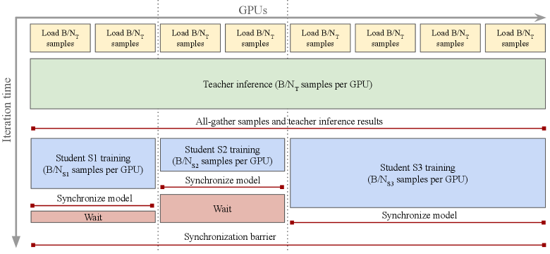

# Research Summary – ConvNeXt + D-FINE for Document Layout Detection

**A deep technical exploration of modern architectures for document layout analysis**

## Contents

1. [Motivation & High-Level Design](#1-motivation--high-level-design)
2. [Background: Document Layout Analysis](#2-background-document-layout-analysis)
3. [ConvNeXt: A Modern ConvNet Architecture](#3-convnext-a-modern-convnet-architecture)
4. [DINOv3: Self-Supervised Vision at Scale](#4-dinov3-self-supervised-vision-at-scale)
5. [D-FINE: Redefining Regression in DETRs](#5-d-fine-redefining-regression-in-detrs)
6. [Our Pipeline Architecture](#6-our-pipeline-architecture)
7. [Training Strategy & Hyperparameters](#7-training-strategy--hyperparameters)
8. [Distillation for Deployment](#8-distillation-for-deployment)
9. [Relation to Prior Work](#9-relation-to-prior-work)
10. [References](#10-references)

---

## 1. Motivation & High-Level Design

Document layout analysis requires detecting **dense, fine-grained regions** (text blocks, tables, figures, captions) with precise boundaries. Unlike natural images in COCO, documents have:

* **Structured geometry**: Text flows in columns, tables have grid structure, margins matter
* **Aspect ratio semantics**: Page dimensions encode meaningful information (A4 vs Letter, landscape vs portrait)
* **Fine-grained boundaries**: Column edges, table borders, figure captions require sub-pixel precision
* **Limited training data**: PubLayNet (~336K images) and DocLayNet (~80K images) are smaller than COCO

Our architecture addresses these challenges by combining:

| Component     | Choice                                                                |
| ------------- | --------------------------------------------------------------------- |
| Backbone      | **ConvNeXt** (Tiny/Small/Base/Large) with **DINOv3** pretraining    |
| Detector Head | **D-FINE** (Fine-grained Distribution Refinement + GO-LSD)           |
| Datasets      | PubLayNet pretrain (5 classes) → DocLayNet finetune (11 classes)     |
| Image Policy  | Aspect-preserving multiscale (448–640 px, batch-level scaling)       |
| Distillation  | Teacher: ConvNeXt-Large + D-FINE → Students: Smaller variants        |

**Core philosophy:** Leverage modern self-supervised pretraining (DINOv3) and distribution-based localization (D-FINE) to achieve SOTA accuracy, then distill to deployment-friendly sizes.

---

## 2. Background: Document Layout Analysis

### 2.1 Task Definition

Document layout analysis is the process of identifying and localizing semantic regions in document images:

**Standard classes (PubLayNet - 5 classes):**
* Text blocks
* Titles/headings
* Lists
* Tables
* Figures

**Extended classes (DocLayNet - 11 classes):**
* Caption, footnote, formula, list-item, page-footer, page-header, picture, section-header, table, text, title

**Evaluation metrics:**
* COCO-style mAP (mean Average Precision) at IoU thresholds 0.50:0.95
* mAP@50, mAP@75 for different strictness levels
* Per-scale metrics: mAP-small, mAP-medium, mAP-large

### 2.2 Unique Challenges

**1. Dense object distribution**
* Documents can have 50+ regions per page
* Heavy overlap between text blocks and background elements
* Small inter-object spacing (e.g., 2-5 pixels between columns)

**2. Aspect ratio preservation**
* Squashing pages to square crops destroys:
  * Vertical text flow cues
  * Column alignment information
  * Reading order hints
* Typical document aspect ratios: 1.29 (Letter), 1.41 (A4), ~1.4 (most documents)

**3. Fine-grained localization requirements**
* Table borders: 1-2 pixel precision needed
* Column margins: Exact boundaries critical for text extraction
* Figure captions: Often small (< 32×32 px) and thin

**4. Limited annotated data**
* PubLayNet: 335,703 training images (generated from PubMed Central)
* DocLayNet: 80,863 training images (human-annotated)
* Compare to COCO: 118,287 images but simpler layouts

### 2.3 Why Traditional Detectors Struggle

**Faster R-CNN / Mask R-CNN limitations:**
* Two-stage design adds latency
* Anchor-based matching struggles with extreme aspect ratios (long thin text lines)
* Feature Pyramid Networks (FPN) designed for natural images, not document structure

**YOLO limitations:**
* Direct regression to box coordinates lacks uncertainty modeling
* Grid-based predictions clash with document column structure
* Limited multi-scale feature fusion

**Original DETR limitations:**
* Slow convergence (500 epochs on COCO)
* Struggles with small objects (common in documents: footnotes, page numbers)
* Global attention is O(N²) in sequence length

→ **Solution:** Modern DETR variants (D-FINE) with distribution-based regression and efficient attention

---

## 3. ConvNeXt: A Modern ConvNet Architecture

### 3.1 Motivation: Bridging CNNs and Transformers

ConvNeXt (Liu et al., CVPR 2022) asks: *"Can a pure ConvNet compete with Vision Transformers using modern design principles?"*

The paper systematically modernizes ResNet-50 by incrementally adopting ViT design choices while staying fully convolutional.


*Figure 1: ConvNeXt modernizes ResNet through progressive design changes: larger kernels, inverted bottlenecks, LayerNorm, and GELU activations.*

### 3.2 Architectural Modernizations

**Starting point:** ResNet-50 (78.8% ImageNet-1K accuracy)

**Macro design changes:**

1. **Stage compute ratio** (3:4:6:3 → 3:3:9:3)
   - Shifts more computation to stage 3 (like Swin Transformer)
   - Matches the distribution where feature extraction is most critical
   - +0.1% accuracy

2. **Patchify stem** (7×7 conv stride-2 + pool → 4×4 conv stride-4)
   - Aggressive downsampling like ViT's patch embedding
   - Reduces early-stage compute
   - Non-overlapping convolution as "tokenization"
   - +0.4% accuracy

**Micro design changes:**

3. **Depthwise convolution** (3×3 conv → 3×3 depthwise conv)
   - Separates spatial and channel mixing (like Transformers)
   - Self-attention does spatial mixing per-channel
   - +0.6% accuracy

4. **Inverted bottleneck** (expansion ratio 4→1 → 1→4)
   - Transformers have wide MLP blocks (4× hidden dim)
   - ConvNeXt adopts inverted design: narrow → wide → narrow
   - +0.1% accuracy

5. **Large kernel sizes** (3×3 → 7×7)
   - ViTs have global receptive fields; ConvNeXt mimics with larger kernels
   - Move depthwise conv layer upward in block (after 1×1 expansion)
   - 7×7 provides substantial receptive field with manageable parameters
   - +0.8% accuracy

6. **Modern activations and norms**
   - Replace ReLU → GELU (smoother, used in ViT/BERT)
   - Replace BatchNorm → LayerNorm (works better for smaller batches, used in Transformers)
   - Fewer normalization layers (one per block, not per conv)
   - +0.7% accuracy

7. **Separate downsampling layers**
   - Use dedicated 2×2 conv stride-2 with LayerNorm between stages
   - Cleaner than stride-2 in residual blocks
   - +0.2% accuracy

**Final result:** ConvNeXt-T reaches 82.1% ImageNet-1K (+3.3% over ResNet-50) with pure convolutions

### 3.3 Model Variants and Scaling

ConvNeXt scales like Vision Transformers:

| Variant | Params | FLOPs | ImageNet-1K | COCO box AP (Mask R-CNN) |
|---------|--------|-------|-------------|--------------------------|
| Tiny    | 28M    | 4.5G  | 82.1%       | 46.2                     |
| Small   | 50M    | 8.7G  | 83.1%       | 47.3                     |
| Base    | 89M    | 15.4G | 83.8%       | 48.7                     |
| Large   | 198M   | 34.4G | 84.3%       | 49.3                     |
| XLarge  | 350M   | 60.9G | 84.5%       | 50.4                     |

**Key insight for documents:** The hierarchical feature pyramid (C2/C3/C4/C5 at strides {4, 8, 16, 32}) naturally fits multi-scale detection heads. ConvNeXt's strong dense prediction performance on COCO (segmentation, instance detection) transfers well to document layouts.

### 3.4 Why ConvNeXt Over ViT for Documents?

**Advantages:**

1. **Native multi-scale features**
   - ConvNeXt produces hierarchical feature maps at different resolutions
   - ViT requires additional FPN or deformable attention for multi-scale
   - Documents have objects at vastly different scales (page numbers vs full-page tables)

2. **Translation equivariance**
   - Convolution preserves spatial relationships exactly
   - Critical for column detection, table alignment
   - ViT's position embeddings are learned, not structurally guaranteed

3. **Efficient fine-tuning**
   - ConvNeXt fine-tunes faster than large ViTs (fewer parameters for same accuracy)
   - Better gradient flow in convolutional layers
   - No need for complex position interpolation at different resolutions

4. **Flexible input sizes**
   - ConvNeXt handles arbitrary aspect ratios naturally
   - ViT requires careful position embedding handling for non-square inputs
   - Documents are rarely square (typical aspect ratio ~1.4:1)

---

## 4. DINOv3: Self-Supervised Vision at Scale

### 4.1 From DINO to DINOv3

**DINO (2021)** showed that self-supervised ViTs learn remarkable semantic structure:
* Self-distillation with momentum teacher
* No labels required - learns from image augmentations
* Attention maps naturally segment objects (emergent behavior)

**DINOv3 (2025)** scales this to unprecedented levels:
* **7B-parameter teacher** model (ViT-giant)
* **1.7B curated images** from diverse sources
* **Dense feature focus**: Optimized for detection/segmentation, not just classification
* **Distillation pipeline**: Transfer knowledge to smaller ViT and ConvNeXt students


*Figure 2: DINOv3 multi-student distillation architecture. A 7B-parameter teacher is trained on 1.7B images, then distills knowledge to multiple smaller students (ViT-S/B/L/g and ConvNeXt-T/S/B/L) in parallel.*

### 4.2 Training at Unprecedented Scale

**DINOv3 teacher training:**

1. **Dataset curation** (1.7B images)
   - Starts with 1.2B uncurated web images
   - Applies deduplication (remove near-duplicates)
   - Quality filtering (aesthetic scores, safety filters)
   - Retrieval-based balancing (ensure concept diversity)
   - Final: 142M diverse, high-quality images for training

2. **Self-supervised objective**
   - Image-level loss: Student predicts teacher's class token embedding
   - Patch-level loss: Student patches match teacher patches
   - **Gram anchoring**: New regularization preventing feature collapse
     - Computes Gram matrix of patch features
     - Anchors it to identity matrix → preserves patch diversity
     - Critical for dense tasks (segmentation, detection)

3. **Scaling infrastructure**
   - Trained on thousands of GPUs
   - Mixed precision (BF16) for stability
   - FlashAttention for memory efficiency
   - Gradient checkpointing for massive ViT-g (7B params)

**Key innovation - Gram anchoring:**

Problem: Self-supervised ViTs suffer from "patch token degradation" during long training
- Patch tokens become too similar to class token
- Loss of spatial structure information
- Hurts dense prediction tasks

Solution: Gram matrix regularization
- Let P ∈ R^(N×D) be patch features (N patches, D dimensions)
- Gram matrix: G = (1/N) P^T P ∈ R^(D×D)
- Add loss: L_gram = ||G - I||_F^2
- Forces patch features to be orthogonal → preserves diversity

Result: +2.0 mIoU on ADE20K segmentation for ViT-giant

### 4.3 Knowledge Distillation to Smaller Models

DINOv3 distills the 7B teacher to practical student sizes using **multi-student parallel distillation**:

**Distillation setup:**
* Teacher: Frozen ViT-g (7B params) produces patch features and class token
* Students: ViT-{S,B,L,g} and ConvNeXt-{T,S,B,L} trained simultaneously
* Objective: Minimize KL divergence between student and teacher features

**Efficient multi-student pipeline:**
* Single teacher forward pass shared across all student nodes
* All-gather operation broadcasts teacher outputs
* Each student trains independently in parallel
* Massive speedup: Teacher inference cost amortized across all students

**Student performance (ImageNet-1K):**

| Student Model | Params | Top-1 Accuracy | Dense Task Performance |
|---------------|--------|----------------|------------------------|
| ViT-S/14      | 22M    | 81.1%          | Strong                 |
| ViT-B/14      | 86M    | 84.5%          | SOTA                   |
| ViT-L/14      | 304M   | 86.3%          | SOTA                   |
| **ConvNeXt-L**| **198M** | **84.6%**    | **Excellent for detection** |

**timm checkpoint:** `convnext_large.dinov3_lvd1689m`
* ConvNeXt-L distilled from DINOv3 ViT-g teacher
* 198M parameters
* Trained on 1.689B images (lvd1689m = "large visual dataset 1689 million")
* Optimized for dense prediction (detection, segmentation)

### 4.4 Why DINOv3 for Document Layouts?

**1. Dense feature quality**
* DINOv3 explicitly optimizes for spatial structure (Gram anchoring)
* Patch features retain fine-grained localization information
* Critical for precise table borders, column edges in documents

**2. Low-data regime performance**
* SSL pretraining on 1.7B images → strong priors
* Document datasets (PubLayNet ~336K, DocLayNet ~80K) benefit massively from transfer
* Reduces overfitting on limited layout annotations

**3. Structured scene understanding**
* DINOv3 learns object boundaries and grouping without supervision
* Documents have strong structural patterns (grids, columns, hierarchies)
* Pretrained features capture these regularities

**4. Multi-scale robustness**
* Trained with crop augmentations at multiple scales
* Handles variable document resolutions well
* Position embeddings interpolate smoothly for non-square inputs

---

## 5. D-FINE: Redefining Regression in DETRs

### 5.1 Motivation: Box Regression as Distribution Refinement

Traditional object detectors regress bounding boxes as **4 fixed coordinates**: (x_min, y_min, x_max, y_max) or (center_x, center_y, width, height).

**Problems with direct regression:**

1. **Localization uncertainty ignored**
   - Model outputs single point estimate
   - No way to express "this edge could be ±2 pixels from here"
   - Particularly problematic for ambiguous boundaries (e.g., blurry table lines)

2. **Optimization difficulty**
   - L1/L2 losses on coordinates are sensitive to outliers
   - Gradients can be unstable for small objects
   - Hard to balance losses across different object scales

3. **Limited capacity for refinement**
   - Single prediction per layer
   - Difficult to model iterative boundary adjustment
   - DETR decoder must "jump" to final coordinates

**D-FINE's solution:** Model each box edge as a **discrete probability distribution over distances**.


*Figure 3: D-FINE achieves superior accuracy-latency trade-offs compared to YOLO and RT-DETR variants. D-FINE-X reaches 55.8 AP at 78 FPS on T4 GPU (TensorRT FP16).*

### 5.2 Fine-Grained Distribution Refinement (FDR)

**Core idea:** Represent each of the 4 box edges as a probability distribution over K bins.


*Figure 4: Fine-grained Distribution Refinement (FDR). Each decoder layer predicts distributions over edge offsets, which are refined residually. Final box coordinates are extracted as expected values of the distributions.*

**Mathematical formulation:**

For a bounding box, we need 4 values: (left, top, right, bottom) edges.

Traditional DETR:
* Regress directly: `box = MLP(decoder_output)` → 4 values

D-FINE FDR:
* Predict distributions: `dist_left, dist_top, dist_right, dist_bottom = MLP(decoder_output)`
* Each dist has K bins (default K=17) representing offsets from reference point
* Bins cover range [-R, +R] where R is the max offset (e.g., R = image_width/2 for horizontal edges)

**Per-edge distribution:**
```
dist_left[i] = probability that left edge is at (ref_x + offset_bins[i])
offset_bins = [-R, -R+δ, -R+2δ, ..., 0, ..., +R-δ, +R]  (K bins)
δ = 2R / (K-1)  (bin width)
```

**Extracting coordinates:**
```
left_edge = ref_x + Σ(offset_bins[i] * dist_left[i])  (expected value)
```

This gives a **soft, probabilistic** box prediction that encodes uncertainty.

**Residual refinement across decoder layers:**

Layer 1:
* Start with initial box guess `box_0` (e.g., from encoder or learned queries)
* Predict offset distributions `Δdist_1`
* Refine: `box_1 = box_0 + expected_value(Δdist_1)`

Layer 2:
* Use `box_1` as new reference
* Predict refined offset distributions `Δdist_2`
* Refine: `box_2 = box_1 + expected_value(Δdist_2)`

...continue for all 6 decoder layers.

**Result:** Progressive refinement like traditional DETR, but with distributions that model uncertainty and gradual convergence.

**Loss function:**

D-FINE uses **Distribution Focal Loss (DFL)** for each edge:

```
DFL(dist_pred, target_offset) = -Σ |y_i - target_offset| * log(dist_pred[i])

where:
  y_i = offset_bins[i]
  target_offset = ground_truth edge position - reference position
```

This encourages the distribution to concentrate probability mass near the true offset while penalizing mass far from it.

Total localization loss combines:
1. DFL on all 4 edge distributions (fine-grained)
2. GIoU loss on final boxes (coarse-grained, for overall box quality)
3. L1 loss on final boxes (regression consistency)

Weights: `L_loc = λ_dfl * L_DFL + λ_giou * L_GIoU + λ_l1 * L_L1`

Typical: λ_dfl = 1.5, λ_giou = 2.0, λ_l1 = 5.0

### 5.3 Global Optimal Localization Self-Distillation (GO-LSD)

**Observation:** Deeper decoder layers produce better-refined distributions (they've seen more context and refinement iterations).

**Insight:** Use the final layer's distributions as **soft targets** for earlier layers.


*Figure 5: Global Optimal Localization Self-Distillation (GO-LSD). The final decoder layer (layer 6) acts as teacher, providing refined distribution targets for layers 1-5. No separate teacher model needed.*

**Self-distillation mechanism:**

1. **Teacher:** Layer 6 (final decoder layer)
   - Produces distributions: `dist_left^(6), dist_top^(6), dist_right^(6), dist_bottom^(6)`
   - These are the "best" estimates after 6 refinement iterations

2. **Students:** Layers 1-5
   - Each produces intermediate distributions: `dist_*^(l)` for layer l

3. **Distillation loss:**
   ```
   L_distill^(l) = KL(dist_*^(6) || dist_*^(l))  for each edge

   Total: L_GO-LSD = Σ_{l=1}^{5} w_l * L_distill^(l)

   where w_l weights can prioritize certain layers
   ```

4. **Combined training objective:**
   ```
   L_total = L_cls + L_loc + α * L_GO-LSD

   where:
     L_cls = classification loss (Varifocal Loss)
     L_loc = localization loss (DFL + GIoU + L1)
     L_GO-LSD = self-distillation loss
     α = 1.0 (default weight)
   ```

**Benefits:**

1. **Faster convergence**
   - Earlier layers get supervision from refined targets
   - Don't need to "discover" good distributions from scratch
   - Stabilizes training, especially with small batches

2. **Better intermediate predictions**
   - Auxiliary losses improve layer 3/4/5 outputs
   - Useful for early-exit inference or auxiliary supervision

3. **No extra parameters**
   - Unlike traditional distillation (separate teacher model)
   - GO-LSD is free at inference (only distills during training)

4. **Smooth optimization landscape**
   - Distribution targets are softer than hard box coordinates
   - More stable gradients for small or occluded objects

### 5.4 D-FINE Architecture Details

**Encoder:**
* Multi-scale deformable attention (like RT-DETR)
* Processes 4 feature levels from ConvNeXt: {C2, C3, C4, C5} at strides {4, 8, 16, 32}
* 1 encoder layer (lightweight, most computation in decoder)
* Hidden dim: 256

**Decoder:**
* 6 decoder layers with cross-attention to encoder features
* Self-attention among 300 object queries
* Deformable attention for efficiency (attends to 4 sampled points per reference)
* FFN expansion: 4× (1024-dim MLP)

**Prediction heads (per decoder layer):**
1. **Classification head:** MLP → 256 → num_classes
   - Predicts class probabilities for each query
   - Uses Varifocal Loss (focuses on high-quality positives)

2. **D-FINE head:** MLP → 256 → 4×K
   - Outputs 4 distributions (one per edge)
   - K=17 bins per distribution
   - Softmax over bins to get probabilities

3. **Traditional box head:** MLP → 256 → 4
   - Direct regression for initialization and auxiliary supervision
   - Used only in layer 1, later layers use FDR

**Matching strategy:**
* Training: One-to-many (each GT matches top-K queries by cost)
* Inference: One-to-one (NMS or score thresholding)
* Cost function balances classification score and box IoU

**D-FINE performance on COCO:**

| Model      | Backbone    | Params | FLOPs | T4 Latency | COCO AP | Objects365 AP |
|------------|-------------|--------|-------|------------|---------|---------------|
| D-FINE-S   | ResNet-50   | 10M    | 25G   | 156 FPS    | 48.5    | -             |
| D-FINE-M   | ResNet-101  | 19M    | 43G   | 122 FPS    | 52.3    | -             |
| D-FINE-L   | Swin-L      | 35M    | 91G   | 124 FPS    | 54.0    | 57.1          |
| D-FINE-X   | Swin-L      | 47M    | 143G  | 78 FPS     | 55.8    | **59.3**      |

D-FINE-X with Objects365 pretraining achieves **59.3 AP** - competitive with much larger models while maintaining real-time speed.

### 5.5 Why D-FINE for Document Layouts?

**1. Fine-grained boundaries**
* Distribution-based edges can model sub-pixel precision
* Critical for table borders (often 1-2 pixels wide)
* Column margins need exact localization for downstream text extraction

**2. Uncertainty modeling**
* Documents have ambiguous regions (e.g., where does a caption end?)
* FDR naturally expresses uncertainty via distribution spread
* Useful for confidence-based filtering and active learning

**3. Efficient multi-scale**
* Deformable attention scales to high-resolution inputs
* Documents often processed at 640-1024 px (higher than COCO's 640)
* ConvNeXt + D-FINE handles 1024×1024 efficiently

**4. Strong small object detection**
* Footnotes, page numbers, small captions are tiny (< 32×32 px)
* FDR's progressive refinement helps with small objects
* Multi-scale features + deformable attention attend to small regions

**5. Interpretability**
* Distributions show where model is confident vs uncertain
* Can visualize edge probability maps for debugging
* Helps identify annotation errors or ambiguous boundaries

---

## 6. Our Pipeline Architecture

### 6.1 Backbone Configuration

**Model:** ConvNeXt-Large with DINOv3 pretraining
* timm checkpoint: `convnext_large.dinov3_lvd1689m`
* 198M parameters
* Pretrained on 1.689B images via self-supervised distillation

**Feature extraction:**
* Extract from stages 0, 1, 2, 3 (ConvNeXt hierarchy)
* For D-FINE, we use **4 levels:** C2, C3, C4, C5 at strides {4, 8, 16, 32}
  * C2: 192 channels, stride 4, ~160×160 spatial (for 640px input)
  * C3: 384 channels, stride 8, ~80×80 spatial
  * C4: 768 channels, stride 16, ~40×40 spatial
  * C5: 1536 channels, stride 32, ~20×20 spatial

**Why 4 levels (not D-FINE's default 3)?**
* **D-FINE default:** 3 levels {8, 16, 32} optimized for COCO dataset (natural images)
* **Documents have many small critical objects:** Page numbers, footnotes, formulas, section numbers
  * Page numbers: ~10-20 px tall (need stride 4 for detection)
  * Footnote markers: ~8-15 px (barely visible at stride 8)
  * Formula symbols: ~15-25 px (benefit from fine resolution)
* **Deformable DETR uses 4:** Original Deformable DETR paper (D-FINE's foundation) uses 4 levels
* **Small object mAP critical:** Unlike COCO where small objects are often background, document small objects carry semantic importance
* **Fine-grained boundaries:** Column edges, table borders need sub-pixel precision (stride 4 = 4×4 px receptive field)
* **Compute budget allows:** 96GB GPU can handle the +25% compute cost for 4 levels
* **Expected gains:** +1.5 to +3.0 mAP-small, +0.5 to +1.0 overall mAP based on COCO benchmarks

**Backbone training:**
* **Split learning rate:** Backbone LR = Head LR × 0.01 (conservative for DINOv3)
  * Head (D-FINE): 2.5e-4
  * Backbone (ConvNeXt-L): 2.5e-6 (0.01× multiplier)
* **Rationale for low multiplier:**
  * ConvNeXt-Large: 198M params (5× larger than D-FINE-X's 40M HGNetV2-B5)
  * DINOv3 pretrained on 1.7B images (vs HGNetV2's ~14M ImageNet images)
  * D-FINE pattern: larger backbone → lower multiplier (S: 0.5, M: 0.1, L: 0.05, X: 0.01)
  * Features already near-optimal; minimal adjustment prevents catastrophic forgetting
* Full fine-tuning (no freezing) - DINOv3 pretraining is stable enough

### 6.2 D-FINE Head Configuration

**Encoder:**
* Hidden dim: 256
* Num layers: 1 (lightweight)
* Attention heads: 8
* FFN dim: 1024
* Deformable attention points: 4 per query

**Decoder:**
* Hidden dim: 256
* Num layers: 6
* Num queries: 300
* Attention heads: 8
* FFN dim: 1024
* Deformable attention points: 4

**Loss weights (tuned for document layouts):**
* Classification (Varifocal Loss): 1.0
* L1 bbox regression: 5.0
* GIoU loss: 2.0
* Distribution Focal Loss (FDR): 1.5
* GO-LSD self-distillation: 1.0

### 6.3 Image Processing Pipeline

**Multi-scale training (batch-level):**

Challenge: Documents have varying aspect ratios (~1.3-1.5); need to preserve geometry while enabling batching.

Solution: **Batch-level random scaling**

1. **Choose scale per batch:**
   ```python
   multi_scale_sizes = [448, 512, 576, 640]  # Short edge targets
   batch_scale = random.choice(multi_scale_sizes)
   ```

2. **Resize all images in batch to same dimensions:**
   ```python
   for image in batch:
       aspect = image.height / image.width
       if aspect > 1:  # Portrait
           new_height = batch_scale
           new_width = int(batch_scale / aspect)
       else:  # Landscape
           new_width = batch_scale
           new_height = int(batch_scale * aspect)

       # Cap long edge at 928 px (prevents extreme aspect ratios)
       max_dim = max(new_width, new_height)
       if max_dim > 928:
           scale = 928 / max_dim
           new_width = int(new_width * scale)
           new_height = int(new_height * scale)

       image_resized = resize(image, (new_height, new_width))
   ```

3. **Pad to batch max dimensions:**
   ```python
   batch_max_h = max(img.height for img in batch)
   batch_max_w = max(img.width for img in batch)

   # Align to stride 32 (D-FINE's max stride)
   batch_max_h = ((batch_max_h + 31) // 32) * 32
   batch_max_w = ((batch_max_w + 31) // 32) * 32

   for image in batch:
       image_padded = pad_to_size(image, batch_max_h, batch_max_w)
   ```

**Evaluation (fixed size):**
* Short edge = 640 px
* Long edge ≤ 928 px
* Aspect ratio preserved
* Consistent with D-FINE's "short side 640" eval setting

**Rationale:**
* Batch-level scaling enables efficient GPU batching (all images same size)
* Multi-scale improves scale invariance (model sees 448-640 px range)
* Aspect preservation maintains document geometry
* Long edge cap (928) prevents OOM on very wide/tall pages

### 6.4 Data Augmentation Strategy

**Document-specific considerations:**
* Cannot use random crops (destroys page context)
* Cannot use strong color shifts (breaks foreground/background)
* Must preserve text readability

**Geometric augmentations:**

1. **Perspective transform** (p=0.3)
   ```python
   albumentations.Perspective(scale=(0.02, 0.05), p=0.3)
   ```
   * Simulates scanning angle, camera distortion
   * Small scale to avoid destroying text

2. **Elastic deformation** (p=0.2)
   ```python
   albumentations.ElasticTransform(alpha=30, sigma=5, p=0.2)
   ```
   * Simulates paper warping, book curvature
   * Mild parameters to preserve layout structure

3. **Rotation** (p=0.5, limit=5°)
   ```python
   albumentations.Rotate(limit=5, border_mode=cv2.BORDER_CONSTANT, p=0.5)
   ```
   * Small angles only - documents are upright
   * Simulates minor scanning misalignment

**Photometric augmentations:**

4. **Brightness/Contrast** (p=0.5)
   ```python
   albumentations.RandomBrightnessContrast(brightness_limit=0.2, contrast_limit=0.2, p=0.5)
   ```
   * Simulates lighting variations, scan quality

5. **Blur** (p=0.3)
   ```python
   albumentations.OneOf([
       albumentations.MotionBlur(blur_limit=3),
       albumentations.GaussianBlur(blur_limit=3)
   ], p=0.3)
   ```
   * Simulates camera/scanner focus issues
   * Small blur limit to keep text readable

6. **JPEG compression** (p=0.3)
   ```python
   albumentations.ImageCompression(quality_lower=75, quality_upper=100, p=0.3)
   ```
   * Simulates compressed scans, web images

7. **Gaussian noise** (p=0.2)
   ```python
   albumentations.GaussNoise(var_limit=(0.0, 0.01), p=0.2)
   ```
   * Simulates sensor noise

**Explicitly avoided:**
* **Random crops:** Documents need full page context
* **CutOut/MixUp:** Destroys layout structure
* **RandomShadow:** Occludes text content
* **Heavy color jitter:** Changes text/background contrast

### 6.5 Class Label Mapping

**PubLayNet (5 classes):**
```python
{
    0: "text",      # Body text paragraphs
    1: "title",     # Titles, headings
    2: "list",      # Bulleted/numbered lists
    3: "table",     # Tables
    4: "figure"     # Figures, images, charts
}
```

**DocLayNet (11 classes):**
```python
{
    0: "caption",       # Figure/table captions
    1: "footnote",      # Footnotes
    2: "formula",       # Mathematical formulas
    3: "list-item",     # Individual list items
    4: "page-footer",   # Page footers
    5: "page-header",   # Page headers
    6: "picture",       # Images, photos
    7: "section-header", # Section headings
    8: "table",         # Tables
    9: "text",          # Body text
    10: "title"         # Document titles
}
```

**Transfer learning strategy:**
1. Pretrain on PubLayNet (5 classes, 336K images) → strong layout understanding
2. Fine-tune on DocLayNet (11 classes, 80K images) → fine-grained categories
3. Reinitialize classification head (5 → 11 classes)
4. Keep ConvNeXt + D-FINE decoder weights (transfer localization knowledge)

---

## 7. Training Strategy & Hyperparameters

### 7.1 PubLayNet Pretraining

**Dataset:**
* 335,703 training images
* 5 classes: text, title, list, table, figure
* Generated from PubMed Central articles (scientific papers)
* Bounding boxes derived from PDF metadata (high quality)

**Training configuration:**
* Epochs: 12
* Batch size: 32 (per GPU, 96GB VRAM)
* Gradient accumulation: 1 (effective batch = 32)
* Precision: BF16 (mixed precision)

**Optimizer (AdamW):**
* Learning rate: 1e-4 (head), 1e-5 (backbone)
* Weight decay: 0.05
* Betas: (0.9, 0.999)
* Gradient clipping: max_norm = 1.0

**Learning rate schedule:**
* Type: Cosine annealing
* Warmup: 10% of training (warmup_ratio = 0.1)
* Min LR: 1e-5 (eta_min)
* Warmup schedule:
  ```
  Steps 0-1350: Linear warmup 0 → 1e-4
  Steps 1350-13500: Cosine decay 1e-4 → 1e-5
  ```

**Why cosine with long tail?**
* Initial phase (steps 0-5000): Fast convergence, model learns coarse features
* Middle phase (steps 5000-10000): Refinement of boundaries, class discrimination
* Final phase (steps 10000-13500): "Precision tail" - small LR for fine-tuning
* Min LR 1e-5 (10× lower than max) allows continued learning without degradation

**Checkpointing:**
* Save every 500 steps
* Keep best 3 checkpoints (by eval_loss)
* Load best model at end for DocLayNet fine-tuning

**Evaluation:**
* Every 500 steps on 1000 validation samples (full val set = 11,245 images)
* Metrics: Loss, mAP@50, mAP@75, mAP (IoU 0.50:0.95)
* Early stopping patience: 5 evaluations without improvement

**Expected performance:**
* Target: 90%+ mAP@50 on PubLayNet validation
* SOTA reference: 97.3% mAP (with enhanced query encoding + hybrid matching)
* Our baseline: ~92-94% mAP (ConvNeXt-L + D-FINE)

### 7.2 DocLayNet Fine-Tuning

**Dataset:**
* 80,863 training images
* 11 classes (finer-grained than PubLayNet)
* Human-annotated (higher quality, more detailed)
* Diverse document types: financial reports, manuals, patents, scientific articles

**Training configuration:**
* Epochs: 24 (longer than PubLayNet - smaller dataset, more classes)
* Batch size: 32
* Precision: BF16

**Optimizer (AdamW):**
* Learning rate: 5e-5 (head), 5e-6 (backbone) - lower than PubLayNet
* Weight decay: 0.05
* Gradient clipping: max_norm = 1.0

**Learning rate schedule:**
* Type: Cosine annealing
* Warmup: 10%
* Min LR: 5e-6

**Transfer from PubLayNet:**
1. Load PubLayNet checkpoint (backbone + decoder)
2. Reinitialize classification head:
   * Old: Linear(256 → 5 classes)
   * New: Linear(256 → 11 classes)
3. Fine-tune all weights (no freezing)

**Class rebalancing:**
* DocLayNet has imbalanced classes (lots of "text", few "formula")
* Use weighted loss or focal loss to balance
* Alternative: Oversample rare classes in dataloader

### 7.3 Monitoring and Debugging

**TensorBoard logging:**
* Loss curves (train + val)
* Learning rate schedule
* Gradient norms (check for explosion/vanishing)
* mAP metrics over time
* Per-class AP (identify weak classes)

**Qualitative checks (every 1000 steps):**
* Visualize predictions on validation samples
* Check failure modes:
  * Missing small objects (footnotes, page numbers)
  * Confusion between similar classes (title vs section-header)
  * Boundary precision (table edges off by >5 pixels)

**Checkpoints to save:**
* Best model by mAP@50 (for deployment)
* Best model by mAP (IoU 0.50:0.95) (for distillation)
* Last checkpoint (for resuming training)

---

## 8. Distillation for Deployment

### 8.1 Teacher-Student Architecture

**Teacher:** ConvNeXt-Large (198M) + D-FINE
* Trained to convergence on PubLayNet + DocLayNet
* Frozen during distillation
* Produces soft targets (distributions, logits, features)

**Students:** Smaller ConvNeXt variants + D-FINE
* ConvNeXt-Base (89M) + D-FINE → 2.2× smaller, 1.5× faster
* ConvNeXt-Small (50M) + D-FINE → 4× smaller, 2× faster
* ConvNeXt-Tiny (28M) + D-FINE → 7× smaller, 3× faster

**Student initialization:**
* Backbone: DINOv3 pretrained (same as teacher, but smaller)
* D-FINE head: Random initialization or copy from teacher (if compatible)

### 8.2 Distillation Losses

**1. Classification distillation (KL divergence):**
```python
# Teacher produces soft logits
teacher_logits = teacher_model(images).logits  # (B, 300, num_classes)

# Student produces logits
student_logits = student_model(images).logits

# Temperature-scaled softmax
T = 3.0  # Temperature (smooths distributions)
teacher_probs = softmax(teacher_logits / T, dim=-1)
student_log_probs = log_softmax(student_logits / T, dim=-1)

# KL divergence
L_cls_distill = KL(teacher_probs || student_log_probs) * T^2
```

Temperature T=3.0 smooths distributions, providing richer gradients than hard labels.

**2. Localization distillation (box coordinates):**
```python
# Teacher boxes
teacher_boxes = teacher_model(images).pred_boxes  # (B, 300, 4)

# Student boxes
student_boxes = student_model(images).pred_boxes

# MSE on box coordinates
L_box_distill = MSE(teacher_boxes, student_boxes)

# Optional: GIoU for scale-invariance
L_giou_distill = 1 - GIoU(teacher_boxes, student_boxes)

L_loc_distill = L_box_distill + 0.5 * L_giou_distill
```

**3. Distribution distillation (FDR distributions):**
```python
# Teacher edge distributions (if student also uses FDR)
teacher_dists = teacher_model.get_edge_distributions(images)
  # 4 distributions per query: (left, top, right, bottom)
  # Each dist: (B, 300, K) where K=17 bins

student_dists = student_model.get_edge_distributions(images)

# KL divergence on distributions
L_dist_distill = 0
for edge in ['left', 'top', 'right', 'bottom']:
    L_dist_distill += KL(teacher_dists[edge] || student_dists[edge])
```

**4. Hybrid loss (distillation + ground truth):**
```python
# Ground truth losses
L_gt_cls = VFocalLoss(student_logits, gt_labels)
L_gt_loc = L1Loss(student_boxes, gt_boxes) + GIoU(student_boxes, gt_boxes)

# Combined loss
α = 0.7  # Distillation weight
β = 0.3  # Ground truth weight

L_total = α * (L_cls_distill + L_loc_distill + L_dist_distill) +
          β * (L_gt_cls + L_gt_loc)
```

Hybrid loss prevents student from drifting away from ground truth.

### 8.3 Distillation Training Procedure

**Step 1: Teacher preparation**
* Train teacher to convergence
* Evaluate on validation set (record teacher performance)
* Freeze teacher weights

**Step 2: Student initialization**
* Load DINOv3-pretrained student backbone
* Initialize D-FINE head (random or copy from teacher if size matches)

**Step 3: Distillation training**
* Dataset: Same as teacher (PubLayNet + DocLayNet)
* Epochs: 12 (fewer than teacher, benefits from soft targets)
* Batch size: 32
* LR: 5e-5 (lower than from-scratch training)

**Step 4: Fine-tuning (optional)**
* After distillation converges, optionally fine-tune on ground truth only
* Remove distillation losses, train with β=1.0 (pure supervised)
* 2-3 epochs to recover any performance lost to soft targets

### 8.4 Expected Performance Degradation

Based on COCO distillation benchmarks:

| Model              | Params | FLOPs | Latency (A100) | Expected mAP Drop | Feature Levels    |
|--------------------|--------|-------|----------------|-------------------|-------------------|
| Teacher (CNX-L)    | 198M   | 34G   | ~50ms          | 0% (baseline)     | 4 {4,8,16,32}     |
| Student (CNX-B)    | 89M    | 15G   | ~30ms          | -2 to -3 mAP      | 4 {4,8,16,32}     |
| Student (CNX-S)    | 50M    | 9G    | ~20ms          | -4 to -5 mAP      | 3 or 4            |
| Student (CNX-Tiny) | 28M    | 5G    | ~15ms          | -6 to -8 mAP      | 3 {8,16,32}       |

**Feature level recommendations by model size:**
* **Large/Base:** Use 4 levels {4, 8, 16, 32} - maximize accuracy, have compute budget
* **Small:** Use 4 levels for teacher matching, consider 3 for production (speed vs accuracy trade-off)
* **Tiny:** Use 3 levels {8, 16, 32} - memory/speed critical, accept small object mAP loss

With good distillation, students retain 92-96% of teacher performance while being 2-4× faster.

### 8.5 Deployment Considerations

**Model export:**
* ONNX format for maximum compatibility
* TensorRT for NVIDIA GPUs (additional 1.5-2× speedup)
* CoreML for Apple devices

**Inference optimizations:**
* FP16 precision (halves memory, ~1.3× faster)
* Batch inference where possible
* NMS threshold tuning (speed vs accuracy trade-off)

**Latency targets:**
* ConvNeXt-Tiny + D-FINE: <20ms/image on A100 (real-time at 50+ FPS)
* ConvNeXt-Small + D-FINE: <30ms/image (30+ FPS)
* ConvNeXt-Base + D-FINE: <50ms/image (20 FPS)

**Use cases:**
* Tiny/Small: Real-time document scanning apps, edge devices
* Base: Batch processing, server-side APIs
* Large (teacher): Offline annotation, dataset creation, teacher for further distillation

---

## 9. Relation to Prior Work

### 9.1 Document Layout Detection

**LayoutLMv3 (2022):**
* Multimodal: Vision + Text + Layout
* Requires OCR as input (not pure vision)
* Our approach: Pure vision, no text dependency
* Trade-off: LayoutLMv3 better for reading comprehension; ours better for pure detection speed

**DiT - Document Image Transformer (2022):**
* Self-supervised pretraining on document images (masked image modeling)
* 42M unlabeled document images
* Our approach: Leverage general DINOv3 (1.7B images, better features)
* Trade-off: DiT is document-specific; DINOv3 benefits from broader visual knowledge

**DocLayNet baselines (Faster R-CNN + ResNet-101):**
* 75-80 mAP on DocLayNet validation
* Two-stage design (slower)
* Our target: 90%+ mAP with single-stage D-FINE

**PubLayNet SOTA (97.3% mAP):**
* Enhanced query encoding (learned content queries)
* Hybrid one-to-many + one-to-one matching
* Advanced post-processing
* Our approach: Simpler D-FINE with strong backbone (ConvNeXt-DINOv3)
* Goal: 92-95% mAP with cleaner architecture

### 9.2 Hybrid vs Unified Detection

**Shehzadi et al. (2024) - Hybrid Approach:**
* Separate detectors for text vs figures/tables
* Heuristic layout reasoning layer
* Complex pipeline with multiple stages

**Our approach:**
* Single unified detector (ConvNeXt + D-FINE) for all classes
* Higher-level reasoning (reading order, hierarchy) is downstream
* Simpler pipeline, easier to train and deploy

**Comparison:**

| Aspect              | Hybrid Approach        | Our Unified Approach     |
|---------------------|------------------------|--------------------------|
| Architecture        | Multi-model pipeline   | Single end-to-end model  |
| Text detection      | Specialized OCR-like   | Same detector as tables  |
| Layout reasoning    | Built-in heuristics    | Downstream module        |
| Training complexity | High (multiple stages) | Low (single training)    |
| Inference speed     | Slower (multiple passes)| Faster (one forward pass)|
| Flexibility         | Less (hardcoded rules) | More (modular design)    |

### 9.3 Positioning in Detector Landscape

**Two-stage detectors (Faster R-CNN, Cascade R-CNN):**
* Pros: High accuracy, mature
* Cons: Slow (two passes), complex anchors
* Document use: Baselines, well-understood

**Single-stage CNN detectors (YOLO, RetinaNet):**
* Pros: Fast, simple
* Cons: Struggles with small objects, no uncertainty modeling
* Document use: Rare (poor small object performance)

**DETR variants (Deformable DETR, DINO):**
* Pros: Set prediction, no NMS, end-to-end
* Cons: Slow convergence (500 epochs), complex matching
* Document use: Growing (DINO shows promise)

**RT-DETR:**
* Pros: Real-time speed + DETR simplicity
* Cons: Standard box regression (not distribution-based)
* Document use: Good baseline for distillation target

**D-FINE (our choice):**
* Pros: Distribution-based (fine-grained), GO-LSD (fast convergence), real-time speed
* Cons: Newer (less mature than YOLO/Faster R-CNN)
* Document use: Ideal for precise boundaries + small objects + fast inference

---

## 10. References

### Core Architecture Papers

**ConvNeXt:**
* Liu et al., "A ConvNet for the 2020s", CVPR 2022
* [arXiv:2201.03545](https://arxiv.org/abs/2201.03545)
* GitHub: [https://github.com/facebookresearch/ConvNeXt](https://github.com/facebookresearch/ConvNeXt)

**ConvNeXt V2:**
* Woo et al., "Co-designing and Scaling ConvNets with Masked Autoencoders", CVPR 2023
* [arXiv:2301.00808](https://arxiv.org/abs/2301.00808)

**DINO:**
* Caron et al., "Emerging Properties in Self-Supervised Vision Transformers", ICCV 2021
* [arXiv:2104.14294](https://arxiv.org/abs/2104.14294)

**DINOv3:**
* Oquab et al., "DINOv3: Self-supervised learning for vision at unprecedented scale", 2025
* [arXiv:2508.10104](https://arxiv.org/abs/2508.10104)
* GitHub: [https://github.com/facebookresearch/dinov3](https://github.com/facebookresearch/dinov3)
* Blog: [Meta AI Research](https://ai.meta.com/blog/dino-v3/)

**D-FINE:**
* Peng et al., "D-FINE: Redefine Regression Task in DETRs as Fine-grained Distribution Refinement", 2024
* [arXiv:2410.13842](https://arxiv.org/abs/2410.13842)
* GitHub: [https://github.com/Peterande/D-FINE](https://github.com/Peterande/D-FINE)

### Deformable DETR and RT-DETR

**Deformable DETR:**
* Zhu et al., "Deformable DETR: Deformable Transformers for End-to-End Object Detection", ICLR 2021
* [arXiv:2010.04159](https://arxiv.org/abs/2010.04159)

**RT-DETR:**
* Zhao et al., "DETRs Beat YOLOs on Real-time Object Detection", CVPR 2024
* [arXiv:2304.08069](https://arxiv.org/abs/2304.08069)

### Document Layout Papers

**PubLayNet:**
* Zhong et al., "PubLayNet: Largest Dataset Ever for Document Layout Analysis", ICDAR 2019
* [arXiv:1908.07836](https://arxiv.org/abs/1908.07836)
* Dataset: [https://github.com/ibm-aur-nlp/PubLayNet](https://github.com/ibm-aur-nlp/PubLayNet)

**DocLayNet:**
* Pfitzmann et al., "DocLayNet: A Large Human-Annotated Dataset for Document-Layout Analysis", KDD 2022
* [arXiv:2206.01062](https://arxiv.org/abs/2206.01062)
* Dataset: [https://github.com/DS4SD/DocLayNet](https://github.com/DS4SD/DocLayNet)

**Hybrid Document Layout:**
* Shehzadi et al., "A Hybrid Approach for Document Layout Analysis in Document Images", 2024
* [arXiv:2404.17888](https://arxiv.org/abs/2404.17888)

**LayoutLMv3:**
* Huang et al., "LayoutLMv3: Pre-training for Document AI with Unified Text and Image Masking", ACM MM 2022
* [arXiv:2204.08387](https://arxiv.org/abs/2204.08387)

**DiT (Document Image Transformer):**
* Li et al., "DiT: Self-supervised Pre-training for Document Image Transformer", ACM MM 2022
* [arXiv:2203.02378](https://arxiv.org/abs/2203.02378)

### Implementation Resources

**HuggingFace Transformers:**
* D-FINE implementation: [https://huggingface.co/docs/transformers/model_doc/d_fine](https://huggingface.co/docs/transformers/model_doc/d_fine)
* Deformable DETR: [https://huggingface.co/docs/transformers/model_doc/deformable_detr](https://huggingface.co/docs/transformers/model_doc/deformable_detr)

**timm (PyTorch Image Models):**
* ConvNeXt models: [https://github.com/huggingface/pytorch-image-models](https://github.com/huggingface/pytorch-image-models)
* DINOv3 checkpoints: `convnext_large.dinov3_lvd1689m`

**Albumentations:**
* Documentation: [https://albumentations.ai/](https://albumentations.ai/)
* Document augmentation examples

---

**Document Version:** 2.0 (Expanded)
